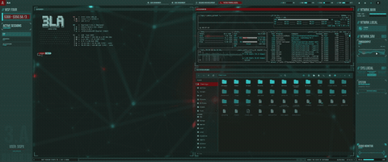

# Hypr-3LA

Hyprland plugins that give a tiling desktop a CCTV / surveillance-rig
aesthetic: **[3LA-Corners](#3la-corners)** frames every window with
targeting-reticle corner brackets, **[3LA-GlitchClose](#3la-glitchclose)**
kills windows with a GLSL "signal lost" collapse instead of letting them blink
out, and **[3LA-TitleBars](#3la-titlebars)** reserves a solid-color bar above the
top of every window, with the window's title drawn on it.

All are C++ Hyprland plugins built against **Hyprland 0.56.2**, configured
either through classic `hyprland.conf` keywords or Hyprland's Lua config
(`hl.config`), and installable with `hyprpm`.

```
3LA-Corners/              corner brackets decoration
3LA-GlitchClose/          GLSL shader signal-loss collapse
3LA-GlitchClose-Viewer/   WebGL tuner for the shader above
3LA-TitleBars/            solid-color title bar overlay
hyprpm.toml               plugin manifest + Hyprland/plugin commit pins
```

Each plugin directory is self-contained: `make` there produces the `.so`, and
`autoload.sh` is a startup fallback that loads it via `hyprctl` and re-applies
its settings.

## Demo

Three kitty terminals framed by 3LA-Corners, closed one by one through
`glitchclose:close`. Setup runs at 2×; the closes are real time:


([full-quality mp4](assets/glitchclose-demo.mp4))

Every frame of the collapse is one fragment-shader pass: v-sync seam, slice
tearing, macroblock corruption, whole-frame ghost copies, chromatic aberration
and static, with the caption composited on top so it stays legible. The window's
own border stays clean throughout — the effect is inset strictly inside it.

A live desktop with 3LA-TitleBars on every window, switching between the
tiled layout and a fullscreen workspace. The kitty terminal keeps its own
title, while the `btop` and file-manager windows are relabeled by
`title_rules` to SYSTEM MONITOR and FILE SYSTEM EXPLORER:



([full-quality mp4](assets/titlebars-demo.mp4))

## Requirements

### To run

| | |
|---|---|
| **Hyprland 0.56.2** | Matched on *commit hash*, not version string, so two 0.56.2 builds from different commits still mismatch — see [Rebuilding after a Hyprland update](#rebuilding-after-a-hyprland-update) |
| **A GL renderer** | 3LA-GlitchClose needs raw GL calls; on a Vulkan backend it logs an error, raises a notification and disables itself rather than misbehaving. 3LA-Corners is unaffected. |

Nothing else. The built `.so` links only the C++ runtime — every Hyprland and GL
symbol (183 of them in 3LA-GlitchClose) is deliberately left undefined and
resolves against the running compositor at `dlopen`. That is why there is no
`-l` flag anywhere in the Makefiles, and why the plugin has no shared-library
dependencies of its own to install.

### To build

On Arch, everything comes from the official repos:

```sh
sudo pacman -S --needed hyprland gcc make binutils pkgconf
```

| package | provides | why |
|---|---|---|
| `hyprland` | `/usr/include/hyprland`, `/usr/share/pkgconfig/hyprland.pc`, `hyprpm` | the headers the plugins compile against |
| `gcc` | `g++` | the Makefiles ask for `-std=c++26` |
| `make` | `make` | build driver |
| `binutils` | `strip` | release builds are stripped |
| `pkgconf` | `pkg-config` | resolves the include paths |

Hyprland's own pkg-config `Requires` — aquamarine, hyprutils, hyprlang,
hyprgraphics, hyprcursor, cairo, pixman, libdrm, libglvnd, libxkbcommon,
libinput, wayland, libxcb, xcb-util-errors, freetype2, libpng — are all
dependencies of the `hyprland` package itself, so a working Hyprland install
already satisfies them. There is no separate `-devel` split on Arch: the
headers ship in the same package as the compositor.

**On other distributions** you need whatever package carries the Hyprland
headers and `hyprland.pc` (often `hyprland-devel`), or a Hyprland built from
source with its headers installed. Verify before building:

```sh
pkg-config --modversion hyprland          # must equal your running compositor
pkg-config --cflags hyprland pixman-1 libdrm
hyprctl version | head -3
```

If `pkg-config --modversion hyprland` fails, the headers are missing or not on
`PKG_CONFIG_PATH`, and every build below will fail with `hyprland.pc not found`.

### Optional

| what | Arch package | needed for |
|---|---|---|
| `python3` | `python` | regenerating the shader tuner's bundle (`3LA-GlitchClose-Viewer`) |
| `glslangValidator` | `glslang` | `make -C 3LA-GlitchClose-Viewer check`, which compiles the extracted GLSL headlessly |
| `update-desktop-database` | `desktop-file-utils` | `make -C 3LA-GlitchClose-Viewer install-desktop` |
| a WebGL2 browser | `google-chrome` / `chromium` / `firefox` | opening the tuner; the shader is GLSL ES 3.00 so WebGL1 will not run it |
| `cmake`, `meson`, `ninja`, `git` | same names | only for the `hyprpm` route, which builds its own header copy |

## Building and installing

Two routes. **hyprpm** is less to remember and handles rebuilds; **manual** is
better if you are editing the plugins, since it skips the header rebuild.

### Option A — hyprpm

`hyprpm` reads [`hyprpm.toml`](hyprpm.toml) from the repo root, which declares
both plugins and their `make` lines.

```sh
hyprpm update                                     # build headers for your Hyprland
hyprpm add https://github.com/ne0tt/Hypr-3LA
hyprpm enable 3LA-Corners
hyprpm enable 3LA-GlitchClose
hyprpm list                                       # confirm both show enabled: true
```

`hyprpm update` clones and configures Hyprland to produce its own header set,
so it needs the toolchain Hyprland builds with (`cmake`, `meson`, `ninja`,
`git`) and takes a few minutes the first time.

Then load them at every startup — in `hyprland.conf`:

```ini
exec-once = hyprpm reload -n
```

or in `hyprland.lua`, from inside your `hyprland.start` handler:

```lua
hl.exec_cmd("hyprpm reload -n")
```

The `commit_pins` entry in `hyprpm.toml` pairs a Hyprland commit with a
plugin-repo commit. The pin currently matches the `hyprland` package's
`GIT_COMMIT_HASH` (`efb5099…`). If you fork this repo, bump the *second* hash
after committing or `hyprpm update` will keep fetching the older revision.

### Option B — build from source

```sh
git clone https://github.com/ne0tt/Hypr-3LA
cd Hypr-3LA

make -C 3LA-Corners
make -C 3LA-GlitchClose
```

Each plugin directory is self-contained and has no build order between them.
Useful targets, identical in both:

| target | effect |
|---|---|
| `make` / `make all` | optimised, stripped `.so` |
| `make debug` | adds `-g`; forces a clean rebuild first |
| `make clean` | removes the `.so` |

`-g` is left out of release builds on purpose: on 3LA-Corners it inflated the
`.so` roughly 33× (3.3 MB against ~100 KB) with no codegen benefit. The dynamic
exports Hyprland needs survive stripping either way, so `make debug` is only
worth it when you actually need a readable backtrace.

Expected output — roughly 110 KB and 440 KB:

```sh
ls -la 3LA-Corners/3LA-Corners.so 3LA-GlitchClose/3LA-GlitchClose.so
```

Load them into the running compositor:

```sh
hyprctl plugin load "$PWD/3LA-Corners/3LA-Corners.so"
hyprctl plugin load "$PWD/3LA-GlitchClose/3LA-GlitchClose.so"
```

`hyprctl plugin load` needs an **absolute** path. To load at startup, from
`hyprland.lua`:

```lua
hl.plugin.load(os.getenv("HOME") .. "/git/Hypr-3LA/3LA-Corners/3LA-Corners.so")
hl.plugin.load(os.getenv("HOME") .. "/git/Hypr-3LA/3LA-GlitchClose/3LA-GlitchClose.so")
```

Each plugin also ships an `autoload.sh` as a startup fallback: it loads the
`.so` via `hyprctl` only if it is not already present, then re-applies settings,
so it is safe to run repeatedly and covers the case where the `hl.plugin.load`
above doesn't take. See [Reference setup](#reference-setup-lua-config) for the
complete working wiring, including where to hook it.

Then apply settings and reload without restarting Hyprland:

```sh
hyprctl eval 'dofile(os.getenv("HOME") .. "/.config/hypr/config/plugins.lua")'
```

### Verifying the install

```sh
hyprpm list                                        # hyprpm route
hyprctl plugin list                                # either route — both should appear
hyprctl getoption plugin:3la_glitch_close:duration # a registered option proves init ran
```

A plugin that loaded but whose config values are missing (`no such option`)
almost always means an option was created but never passed to
`HyprlandAPI::addConfigValueV2`.

### Rebuilding after a Hyprland update

**Both plugins must be rebuilt every time Hyprland updates.** The API commit
hash is baked in at compile time from the headers and compared against the
running compositor's at load:

```cpp
if (std::string{__hyprland_api_get_hash()} != std::string{__hyprland_api_get_client_hash()})
    throw std::runtime_error("version mismatch");
```

A mismatch refuses to load with a notification instead of crashing the
compositor, so a stale build is an annoyance rather than a broken session.

```sh
# hyprpm route
hyprpm update && hyprpm reload

# manual route
make -C 3LA-Corners clean && make -C 3LA-Corners
make -C 3LA-GlitchClose clean && make -C 3LA-GlitchClose
hyprctl plugin unload "$PWD/3LA-GlitchClose/3LA-GlitchClose.so"
hyprctl plugin load   "$PWD/3LA-GlitchClose/3LA-GlitchClose.so"
```

Unload before load when reloading a rebuilt `.so` — loading over an already
loaded plugin of the same name is refused.

### The shader tuner (optional)

`3LA-GlitchClose-Viewer` is a WebGL2 tuner that extracts the GLSL, the option
list, the defaults and the ranges straight from the plugin sources, so it can
never drift from what the compositor actually draws.

```sh
make -C 3LA-GlitchClose-Viewer            # regenerate generated.js
make -C 3LA-GlitchClose-Viewer check      # compile the GLSL headlessly (needs glslang)
make -C 3LA-GlitchClose-Viewer open       # launch it in a browser
make -C 3LA-GlitchClose-Viewer install-desktop   # add to the app launcher
```

Re-run it after touching `shader.hpp` or `main.cpp`.

### Troubleshooting

| symptom | cause | fix |
|---|---|---|
| `hyprland.pc not found` | headers missing or off `PKG_CONFIG_PATH` | install the Hyprland headers package; check `pkg-config --modversion hyprland` |
| Notification: *version mismatch (rebuild against running Hyprland)* | plugin built against different headers than the running compositor | rebuild — see above |
| Notification: *requires the GL renderer* | Hyprland is on the Vulkan backend | 3LA-GlitchClose cannot run there; 3LA-Corners still works |
| `hyprctl plugin load` returns an error | relative path, or already loaded | use an absolute path; `hyprctl plugin unload` first |
| `keyword can't work with non-legacy parsers` | `hyprctl keyword` against the Lua config | use `hyprctl eval 'hl.config{...}'` instead |
| `unknown config key 'plugin.…'` | plugin not loaded, or option never registered | check `hyprctl plugin list`; wrap startup config in `pcall` |
| Builds fine, no visible effect | plugin loaded but settings never applied | re-run your `plugins.lua` via `hyprctl eval 'dofile(…)'` |

## Configuration

Everything in this README uses Hyprland's Lua config: settings are applied with
`hl.config`, wrapped in `pcall` at startup so applying config for a
not-yet-loaded plugin can't break the rest of the config:

```lua
pcall(hl.config, { plugin = {
    ["3la_corners"]      = { offset = 10, length = 40, thickness = 1 },
    ["3la_glitch_close"] = { duration = 700, strength = 1.0, text = "SIGNAL LOST" },
} })
```

(The classic `hyprland.conf` ini keywords work too, with the same option names:
`plugin { 3la_glitch_close { duration = 700 } }`.)

Live-tweak any option without reloading (`hyprctl keyword` does not work with
the Lua parser — use `hl.config`):

```sh
hyprctl eval 'hl.config({ plugin = { ["3la_glitch_close"] = { strength = 2.0 } } })'
hyprctl getoption plugin:3la_glitch_close:duration   # inspect
```

Both plugins read their colours from config on every frame, so feeding
matugen-generated globals into the `col.*` options re-themes a live effect with
no plugin reload.

## Reference setup (Lua config)

The exact wiring from a working config (`~/.config/hypr`):

**`hyprland.lua`** — register the plugins at startup, with an `autoload.sh`
fallback that loads via `hyprctl` and re-applies settings if the startup
registration doesn't take:

```lua
hl.plugin.load(os.getenv("HOME") .. "/git/Hypr-3LA/3LA-Corners/3LA-Corners.so")
hl.plugin.load(os.getenv("HOME") .. "/git/Hypr-3LA/3LA-GlitchClose/3LA-GlitchClose.so")

hl.on("hyprland.start", function()
    hl.exec_cmd(os.getenv("HOME") .. "/git/Hypr-3LA/3LA-Corners/autoload.sh")
    hl.exec_cmd(os.getenv("HOME") .. "/git/Hypr-3LA/3LA-GlitchClose/autoload.sh")
end)

require("config.colors")  -- matugen globals, before anything that uses them
require("config.plugins") -- plugin settings (see below)
```

**`config/plugins.lua`** — the settings, wrapped in `pcall` so applying config
for a not-yet-loaded plugin can't break the rest of the startup. Only options
that differ from the defaults need listing:

```lua
pcall(hl.config, {
    plugin = {
        ["3la_corners"] = {
            offset = 5, length = 30, thickness = 2,
            ["col.active"] = primary,   -- matugen color globals
            ["col.inactive"] = primary, -- same color: no focus-based change
            flash_duration = 150,
            flash_on_focus = 1, focus_flash_count = 3, focus_flash_duration = 75,
            glow = 1, ["glow.size"] = 10, ["glow.strength"] = 0.4,
            ["col.glow"] = 0,           -- follow the bracket color
        }
    }
})

pcall(hl.config, {
    plugin = {
        ["3la_glitch_close"] = {
            duration = 400, fade = 10, close_at = 1.0, -- hold left at its 1000 ms default
            strength = 0.38, aberration = 0.56, blocks = 0.45, noise = 0.00,
            scanlines = 0.8, roll = 0.08, melt = 0.10, vignette = 0.00,
            tear = 0.55, tear_speed = 2.0, ghost = 0.8,
            backdrop_alpha = 0.5,
            ["col.backdrop"] = on_secondary,   -- matugen color globals
            ["col.fringe1"] = on_error,
            ["col.fringe2"] = primary,

            text = "SIGNAL LOST", text_size = 26, text_alpha = 0.85,
            text_at = 0.15, text_blink = 10,
            text_padding = 14, text_bg_round = 0, text_bg_alpha = 0.55,
            ["col.text"] = 0,             -- 0 = white
            ["col.text_bg"] = on_error,
        }
    }
})
```

Note that `hl.config` reports `unknown config key` **per key** for a plugin that
is not loaded, and does so *without raising* — the surrounding `pcall` does not
swallow it. Comment a plugin's settings block out at the same time as its
`hl.plugin.load` line, or every reload prints one error per option.

**`config/keyboard/keybindings.lua`** — the kill key, falling through to a plain
close when the plugin is not loaded (`hl.plugin.glitchclose` only exists while
it is):

```lua
hl.bind(mainMod .. " + Q", function()
    if pcall(function() hl.plugin.glitchclose.close() end) then return end
    hl.dispatch(hl.dsp.window.close())
end, { description = "Close active window (glitch collapse)" })
```

Bind the tuner too, if you are iterating on the shader:

```lua
hl.bind(mainMod .. " + SHIFT + G",
    hl.dsp.exec_cmd(os.getenv("HOME") .. "/git/Hypr-3LA/3LA-GlitchClose-Viewer/run.sh"),
    { description = "GlitchClose shader tuner" })
```

---

# 3LA-Corners

Draws decorative corner brackets outside every window's border. Each corner gets
two line segments (horizontal + vertical) offset outside the window border, like
a targeting reticle. The focused window and unfocused windows can be given
different colors, and either window spawn or focus gain can trigger a flash.

## Config

Defaults shown:

```lua
hl.config({ plugin = { ["3la_corners"] = {
    offset = 10,          -- gap (px) between the window border and the brackets
    length = 100,         -- arm length (px) of each bracket, from the corner
    thickness = 2,        -- line thickness (px)

    ["col.active"] = 0,   -- focused-window bracket color.
                          -- 0 = follow general:col.active_border (first color);
                          -- otherwise e.g. "rgba(33ccffee)"
    ["col.inactive"] = 0, -- unfocused-window bracket color.
                          -- 0 = follow col.active if that is set, else
                          -- general:col.inactive_border (first color)

    flash_count = 3,      -- times the brackets flash when a window SPAWNS (0 = off)
    flash_duration = 150, -- spawn flash on/off phase duration (ms)

    flash_on_focus = 0,         -- flash when a window gains FOCUS (0 = off, 1 = on)
    focus_flash_count = 3,      -- times the brackets flash per focus change (0 = off)
    focus_flash_duration = 150, -- focus flash on/off phase duration (ms)

    glow = 0,             -- soft halo behind the brackets DURING a flash burst
                          -- (0 = off). See "Glow" below: it is not drawn on
                          -- every frame, only while a burst is running.
    ["glow.size"] = 12,   -- halo spread distance (px)
    ["glow.strength"] = 0.5, -- overall halo intensity (0..1)
    ["col.glow"] = 0,     -- 0 = follow the bracket's own color
} } })
```

### Flashing

A burst is `count` on-pulses, each phase lasting `duration` ms, after which the
brackets settle to steady on. The two burst types are configured independently:

| Trigger | Count | Duration | Gate | Priority |
|---|---|---|---|---|
| window spawns | `flash_count` | `flash_duration` | always on | preempts any running burst |
| window gains focus | `focus_flash_count` | `focus_flash_duration` | `flash_on_focus = 1` | dropped while a spawn burst runs |

The focus flash needs **both** `flash_on_focus = 1` and a non-zero
`focus_flash_count`; setting either to `0` disables it. `flash_count = 0`
disables the spawn flash only.

**The spawn burst has priority.** A focus flash cannot preempt a spawn burst
that is still running; it is dropped, and the spawn burst plays to completion.
This matters because a new window takes focus in the same tick it opens, so
without the priority rule the focus burst would replace every spawn burst and
`flash_count` / `flash_duration` would have no visible effect. A spawn burst
preempts anything, including a running focus burst.

Burst parameters are captured when the burst is armed, so changing the options
mid-burst does not retime the burst already in flight. Re-triggering a focus
flash mid-burst restarts the sequence rather than queueing, so rapid alt-tabbing
stays in step with the focus rather than lagging behind it.

Burst expiry is time-based, computed from the instant the burst was armed rather
than from frames drawn. A burst therefore expires on schedule even while nothing
is being rendered — a window that spawns fullscreen (brackets hidden) does not
get stuck mid-burst or suppress its next flash.

### Glow

A soft halo behind the brackets, off by default (`glow = 0`).

**It only renders while a spawn or focus flash burst is actively running** — not
on every frame. The brackets sit plain the rest of the time, so the glow reads as
part of the flash rather than as a permanent style. That also means `glow = 1`
does nothing visible if both flash types are disabled.

It is **not a real blur.** A plugin cannot reach Hyprland's shadow shader, so
this is four expanded copies of each bracket box drawn behind it with fading
alpha — a stepped halo rather than a smooth one. `glow.size` sets how far the
outermost layer expands, `glow.strength` scales the whole stack. At large sizes
the banding between layers becomes visible; it reads best as a tight halo
(≤ ~16px) rather than a wide bloom.

`col.glow = 0` follows the bracket's own colour, including its flash alpha, so
the halo fades in and out with the pulse. Set it explicitly to tint the halo
differently from the brackets.

The decoration's damage region grows by `glow.size` whenever `glow` is on,
because the halo extends past the bracket boxes; without that its outer edge
leaves trails while a window is moved or resized.

### Active / inactive styling

The brackets render at **full alpha regardless of focus**, fully decoupled from
window opacity. The `a` alpha the renderer passes to the decoration is ignored
outright, so none of these affect the brackets:

- `decoration:active_opacity` / `decoration:inactive_opacity`
- per-window `opacity` window rules
- window fade-in/out and workspace-move alpha

Only two things set the final alpha: the alpha channel of the configured color
(`col.active` / `col.inactive`) and the flash envelope. The trade-off is that
brackets pop in at full opacity when a window opens rather than fading with it.

> **If unfocused brackets look "dimmed", check `col.inactive` before suspecting
> opacity.** With `col.inactive = 0` the brackets follow
> `general:col.inactive_border`, which in most themes is a much darker shade than
> `col.active_border` — that reads as dimming but is pure color. Set both colors
> explicitly to the same value for identical brackets in both states.

Color resolution order:

| State | Order |
|---|---|
| focused | `col.active` -> `general:col.active_border` -> white |
| unfocused | `col.inactive` -> `col.active` -> `general:col.inactive_border` -> white |

The unfocused fallback to `col.active` means setting only `col.active` gives every
window the same bracket color. Distinct colors per state:

```lua
hl.config({ plugin = { ["3la_corners"] = {
  ["col.active"] = "rgba(33ccffee)", ["col.inactive"] = "rgba(6a7a85ff)",
} } })
```

## Notes

- The bracket ring is *reserved* space: tiled windows shrink by
  `offset + thickness` per side so brackets never overlap neighbors.
- The top pair of brackets automatically frames the outside of any other
  plugin's reserved top-edge space (e.g. 3LA-TitleBars' bar), rather than
  sitting flush against the window's own — now lower — top edge. This reads
  the decoration positioner's total top-reserved extent and subtracts this
  plugin's own margin, so it stays put with 0 extra offset when nothing else
  reserves top space. The core Hyprland window border is unaffected either
  way — only the brackets move.
- Brackets are hidden on fullscreen windows. A burst armed on such a window still
  expires on its own schedule, since expiry is time-based rather than frame-driven.
- Active state is read per-frame from `Desktop::focusState()->isWindowActive()`,
  and the plugin listens on the `window.active` event to damage both the window
  losing focus and the one gaining it, so brackets repaint immediately on focus
  change. `flash_on_focus` reuses that same listener, subject to the spawn-burst
  priority rule above.
- While a flash is running the decoration damages itself every frame to drive the
  animation, so `flash_on_focus = 1` costs a short burst of redraws per focus
  change. On a heavily loaded GPU prefer a low `focus_flash_count`.

---

# 3LA-GlitchClose

Plays a CCTV "signal lost" collapse over a window when it closes: the window's
own content tears apart, static and a backdrop ramp in over it, a `SIGNAL LOST`
caption appears, and only then does the window actually close.

The whole visual is one GLSL fragment shader — the window snapshot goes through
a single pass into the effect's own framebuffer, which is then composited. So:

- displacement is **continuous and per-pixel**
- the v-sync frame tear is real: the seam has the content on each side evaluated
  at a different animation step
- chromatic aberration is a genuine per-channel UV offset
- static is sub-pixel and never repeats
- one draw call per frame
- every knob is a live uniform, so re-running matugen re-themes a running effect
  without reloading the plugin

## How it renders

Plugins cannot reach Hyprland's projection matrix (`monitorProjection` is
private to `CHyprOpenGLImpl`), so the shader never draws directly to the screen.
Instead, at `RENDER_POST_WINDOWS`:

1. the shader runs over a full-viewport quad into the effect's own framebuffer,
   using identity NDC coordinates — no matrix maths needed
2. that framebuffer is handed to an ordinary `CTexPassElement`, so Hyprland
   keeps owning positioning, clipping, damage and colour management

Because `makeSnapshotFB()` may return a monitor-sized framebuffer rather than a
window-sized one, the `uvOffset` / `uvXf` uniforms map the window's sub-rect onto
0..1 — the glitch geometry stays window-local either way. `uvXf` is a full `mat2`
rather than a scale because that snapshot is rendered through the monitor's own
projection: on a rotated (portrait) monitor the window's pixels sit rotated
inside it, and carrying that rotation in the mapping is what keeps the tearing
running across the window instead of down it. For the same reason the composite
does *not* set `flipEndFrame` — that flag composes the monitor transform's
inverse into the texture transform, which is right for a snapshot FB but would
rotate the finished effect a second time. The mapping is built once per effect
and rebuilt only if the monitor is rescaled or rotated under a live collapse.

Program binding goes through `g_pHyprOpenGL->useShader()` rather than raw
`glUseProgram()`: `CHyprOpenGLImpl` caches the bound program to skip redundant
binds, and desyncing that cache breaks the *next* Hyprland draw. Viewport and
blend go through the renderer wrappers for the same reason.

## The `glitchclose:close` dispatcher (use this to close windows)

Closing first and animating afterwards means the layout has already re-tiled and
the effect plays over the neighbours that took the space. The dispatcher fixes
the ordering: the collapse plays over the still-open window, and the real close
request goes out at `close_at` × `duration` — by default on the frame the burst
ends.

**It always ends on a glitched window.** After the burst the overlay *holds* at
full collapse until the window is really gone, and only then runs the `fade`
tail. Fading earlier would dissolve the glitch back onto the untouched window
that is still sitting there waiting for the app to unmap — the one thing a
glitch close must not end on. Two things make the hold sufficient:

- the window's **own close animation is suppressed** for the duration of the
  effect (`noAnim` at `setprop` priority, the same slot `hyprctl setprop` uses).
  Otherwise Hyprland plays its fade-out snapshot of the real window just as the
  overlay ends, which looks exactly like the window reappearing.
- `hold` caps the wait (default 1000 ms). An application that refuses to close —
  an unsaved-changes dialog — gets the fade anyway and its animations back,
  rather than pinning the glitch on screen.

The tile slot is held for the whole burst, so nothing is drawn over the
neighbours until the close actually goes out; only the hold and the fade can
overlap the re-tile, and by then the collapse is at full opacity. Set `close_at`
below 1 to send the close mid-burst instead.

```lua
hl.bind("SUPER + Q", function() hl.plugin.glitchclose.close() end,
    { description = "Close active window (glitch collapse)" })
```

(Classic configs: `bind = $mainMod, Q, glitchclose:close`.)

Note that `hyprctl dispatch glitchclose:close` does **not** work under the Lua
config parser — it parses the argument as Lua. Use
`hyprctl eval 'hl.plugin.glitchclose.close()'` instead.

Windows closed by something else (an external `killactive`, an app responding to
a close request) still get a post-hoc effect, driven by the `window.close`
event. That event fires at *unmap*, so the snapshot capture usually fails on
this path and the shader falls back to its static-only mode (`hasTex = 0`).
An application that simply **exits on its own** never emits `window.close` at
all, so it gets no effect — this is inherent to the event.

## Config

Defaults shown:

```lua
pcall(hl.config, {
    plugin = {
        ["3la_glitch_close"] = {
            duration = 700,        -- collapse duration (ms)
            fade = 80,             -- fade-out tail (ms), started only once the
                                   -- window is actually gone
            hold = 1000,           -- max ms to hold the finished collapse while
                                   -- waiting for the window to vanish, so the
                                   -- fade never dissolves back onto a live
                                   -- window
            close_at = 1.0,        -- when glitchclose:close sends the real close,
                                   -- as a fraction of `duration` (1 = as the
                                   -- burst ends; the hold then covers the
                                   -- app's close latency)

            strength = 1.0,        -- master multiplier on every displacement
                                   -- term (0 = calm, up to 5 = extreme)
            aberration = 0.5,      -- RGB channel split
            blocks = 0.6,          -- slice tearing + macroblock corruption
            noise = 0.5,           -- digital static
            scanlines = 0.4,       -- CRT scanline darkening
            roll = 0.5,            -- rolling bright bar sweeping the window
            melt = 0.5,            -- wavy vertical tear boundary; 0 = the torn
                                   -- edge shears flat instead of rippling
            tear = 0.5,            -- v-sync frame tear (0 = off)
            tear_speed = 3.0,      -- seam sweeps per burst
            ghost = 0.5,           -- whole-frame echo copies (0 = off)
            vignette = 0.4,        -- edge darkening as the feed collapses
            backdrop_alpha = 0.75, -- opacity the backdrop collapses to

            ["col.backdrop"] = 0,  -- 0 = black
            ["col.fringe1"] = 0,   -- 0 = magenta
            ["col.fringe2"] = 0,   -- 0 = cyan

            -- Caption drawn OVER the shader output (not fed through the
            -- glitch, so it stays legible). Burst and hold, never the fade.
            text = "SIGNAL LOST",  -- "" turns the caption off entirely
            font = "monospace",
            text_size = 16,        -- pt
            text_alpha = 1.0,      -- 0 = plate with no text
            text_at = 0.4,         -- fraction of duration before it appears
            text_blink = 0,        -- blink half-period in ms (0 = steady)
            text_padding = 14,     -- gap between text and plate edge (px)
            text_bg_round = 4,     -- plate corner radius (px)
            text_bg_alpha = 0.85,  -- 0 = text with no plate
            ["col.text"] = 0,      -- 0 = white
            ["col.text_bg"] = 0,   -- 0 = red

            min_size = 80,         -- skip windows smaller than this (px)
            ignore_children = 1,   -- skip dialogs, transients, modals
            ignore_class = "^(xdg-desktop-portal.*)$",
            ignore_title = "",
        }
    }
})
```

`strength` scales *all* displacement; the individual weights are 0..1 dials on
one shader stage each, so `strength = 2, blocks = 0` gives heavy melt and
aberration with no slice displacement.

`ghost` echoes the **whole frame** sideways at low alpha, added rather than
blended so overlaps brighten — text and logos come out doubled. It is what makes
a torn frame read as a *doubled signal* rather than merely displaced strips, and
the most recognisable part of the look. Turn it down to `0` for clean shearing
with no echo.

`blocks` and `tear` are different things despite both being "tearing". `blocks`
scatters many short-lived horizontal strips at random offsets. `tear` is a single
coherent **v-sync seam** that sweeps down the window, with everything below it
shifted sideways as though that half of the frame arrived late — and evaluated
one animation step out of date, so the two sides of the seam carry different
slice, macroblock and grain patterns. That staleness is what makes it read as a
frame boundary rather than a plain horizontal offset. `tear_speed` sets how many
times the seam crosses during the burst; with a short `duration`, 1–2 reads as a
deliberate glitch and anything higher as a strobe.

The caption is composited on top of the shader rather than passed through it, so
it stays readable while the window behind it tears apart. It is drawn through the
burst and the hold but never the fade: a dissolving glitch still reads as an
effect, a legible caption dissolving over whatever is behind it reads as a bug.
Note `text_at` is a fraction of `duration` — with a short `duration` a default of
`0.4` leaves very little time on screen.

For matugen theming, pass the globals from your generated `colors.lua`:

```lua
["col.backdrop"] = background,
["col.fringe1"] = primary,
["col.fringe2"] = on_error,
```

These are read as uniforms every frame, so re-running matugen re-themes a live
effect with no plugin reload.

## Tuning it

The shader has a lot of dials, and closing a terminal every time you want to see
what one does gets old fast. [`3LA-GlitchClose-Viewer/`](3LA-GlitchClose-Viewer)
is a WebGL2 tuner that runs the plugin's actual shader over a still image: scrub
the close animation on a timeline, move the sliders, then hit **copy Lua** for a
ready-to-paste `pcall(hl.config, …)` block.

```sh
make -C 3LA-GlitchClose-Viewer open            # build the bundle and open it
make -C 3LA-GlitchClose-Viewer install-desktop # optional: add to the app launcher
./3LA-GlitchClose-Viewer/run.sh
```

It has no shader of its own. `sync.py` extracts the GLSL from `shader.hpp` and
the option list — keys, defaults, min/max — from `main.cpp`, so the controls are
whatever the plugin currently registers, and a config key with no matching
uniform is a build error rather than a dead slider. See
[3LA-GlitchClose-Viewer/README.md](3LA-GlitchClose-Viewer/README.md).

## Notes

- **The border is never glitched.** The effect box is inset by the window's
  border width, so no border pixel is fed through the shader and the border ring
  stays intact while the content tears apart. Without the inset the box sits
  flush against the border and edge sampling drags border colour inward, drawing
  a bright 1px frame around the effect. The cost is that the outermost 1px ring
  of window content is left untouched, which is not noticeable at typical border
  widths.
- The shader is compiled lazily on the first frame of the first effect (the GL
  context is only guaranteed current mid-render). A compile failure logs, raises
  one notification, and latches off — closes then behave like a plain
  `killactive` rather than retrying every frame.
- Requires the GL renderer; the effect disables itself on a Vulkan backend.
- `ignore_class` / `ignore_title` are C++ `std::regex`, **not** Lua patterns.
- Skip reasons are logged at `TRACE` (enable with `debug:enable_trace`) — useful
  when a close silently produces no effect.

---

# 3LA-TitleBars

Draws a solid-color bar of `height` pixels above every window's top edge, with
the window's own title rendered on it. The space is *reserved*, like a real
titlebar: the window's own content is pushed down by `height + 2 * gap` and
the bar sits above it rather than painting over the app's own top pixels.

## Config

Defaults shown:

```lua
hl.config({ plugin = { ["3la_titlebars"] = {
    height = 24,             -- bar height (px)
    gap = 7,                 -- gap (px) around the bar: above, below and on both sides

    ["col.active"] = "rgba(690005ff)",  -- focused-window bar color
    ["col.inactive"] = 0,               -- unfocused-window bar color.
                                        -- 0 = follow col.active

    ["opacity.active"] = 1.0,   -- opacity (0..1) of the bar, its text and its
    ["opacity.inactive"] = 1.0, -- shadow -- mirrors decoration:active_opacity/
                                -- inactive_opacity, since the bar otherwise
                                -- ignores the renderer's own opacity multiplier

    shadow = 1,                    -- soft shadow behind the bar (0 = off).
                                   -- also off whenever decoration:shadow:enabled
                                   -- is false -- see "Notes" below
    ["shadow.size"] = 20,          -- spread distance (px)
    ["shadow.strength"] = 0.5,     -- overall intensity (0..1)
    ["shadow.col"] = "rgba(000000aa)", -- translucent black

    ["text.size"] = 12,                     -- title font size (px)
    ["text.font"] = "",                     -- title font family (empty = follow misc:font_family)
    ["text.col.active"] = "rgba(ffffffff)", -- title text color, focused window
    ["text.col.inactive"] = 0,              -- title text color, unfocused window.
                                            -- 0 = follow text.col.active

    ignore_class = "",  -- regex of window classes to never give a title bar (empty = none)
    ignore_title = "",  -- regex of window titles to never give a title bar (empty = none)

    title_rules = "",   -- custom titles; see "Custom titles" below (empty = none)
} } })
```

## Custom titles

`title_rules` overrides the text shown on the bar without touching the
window's real title (used elsewhere for matching, alt-tab, etc.). It packs a
list of rules into one string, since a plugin-defined repeatable keyword (the
`windowrulev2`-style approach) has no path in from `hl.config`'s Lua bridge —
only typed config *values* do:

```lua
-- 'class_regex,title_regex,override text' rules, separated by ';'.
-- Either regex may be empty to match any class/title. First match wins.
title_rules = "^(firefox)$,,WEB BROWSER;^(kitty)$,^(btop)$,SYSTEM MONITOR",
```

A window whose class matches `^(firefox)$` (any title) shows "WEB BROWSER"; a
`kitty` window whose title matches `^(btop)$` shows "SYSTEM MONITOR"; every
other window keeps showing its own (still-uppercased) title. Only the first
two commas in a rule are treated as field separators, so the override text
itself may contain commas. All 3 fields are required — a common mistake is
writing a 2-field shorthand like `^(btop)$,SYSTEM MONITOR` meaning "match this
title", which is instead read as a *class* regex with no override text field
and gets skipped; leave the class field empty instead: `,^(btop)$,SYSTEM
MONITOR`. An unparseable rule (missing a field, or an invalid regex) is
skipped individually rather than breaking the whole list, and raises an
in-session notification naming the bad rule and why, rather than just quietly
never matching. Re-parsed only when the string actually changes, same as
`ignore_class` / `ignore_title`.

## Toggling a bar per-window

`3la_titlebars:toggle` flips the bar on the currently **focused** window only
(independent of `ignore_class`/`ignore_title`, and reversible — press again to
bring it back). Exposed two ways:

```lua
-- classic dispatch string (hyprland.conf-style bind, or hl.dsp.exec_cmd("hyprctl dispatch 3la_titlebars:toggle"))
bind = SUPER SHIFT, B, 3la_titlebars:toggle

-- Lua keybind (hl.plugin.titlebars only exists while the plugin is loaded, hence the pcall)
hl.bind("SUPER + SHIFT + B", function()
    pcall(function() hl.plugin.titlebars.toggle() end)
end, { description = "Toggle title bar on active window" })
```

`hyprctl dispatch 3la_titlebars:toggle` does **not** work as-is on a Lua-parsed
config (`hyprctl dispatch` there routes through `hl.dispatch(...)`, which
evaluates its argument as a Lua expression, not a dispatcher string) — use the
Lua function form above, or `hyprctl eval 'hl.plugin.titlebars.toggle()'` for
one-off testing.

## Notes

- The bar is *reserved* space: tiled windows shrink by `height + 2 * gap` to
  make room above them, the same way 3LA-Corners reserves space for its
  brackets. The bar itself is inset by `gap` on every side within that
  reserved slot, so it floats with a margin instead of touching the window's
  own top edge or the reserved area's outer boundary.
- The title text is rendered to a texture and cached per window; it is only
  re-rendered when the title string, resolved color, font family, font size or
  available width actually change, and repainted immediately on a
  `window.title` event (e.g. a browser tab switch) rather than waiting for
  some unrelated redraw. The text is clipped/ellipsised to fit the bar's
  width minus an 8px padding on each side.
- The title is uppercased before rendering (ASCII letters only — accents and
  any icon glyphs in a window title pass through untouched rather than being
  mangled by a byte-wise transform of UTF-8).
- The window's own drop shadow hugs the core border, not the bar: Hyprland
  grows the shadow's box to include any decoration flagged
  `DECORATION_PART_OF_MAIN_WINDOW` (the core border carries it; that's how the
  shadow normally follows it seamlessly), and 3LA-TitleBars deliberately
  leaves that flag off so that shadow stays where it always was.
- The bar's own `shadow` is a *separate*, independent effect, not a second
  copy of the window's shadow — a plugin can't reach Hyprland's real shadow
  shader, so it's the same cheap layered-rect technique 3LA-Corners' `glow`
  already uses: `shadow.size` stacked, expanded, fading-alpha copies of the
  bar's box drawn behind it (6 layers, a stepped halo rather than a smooth
  blur). Sized and colored entirely on its own terms via `shadow.*` — except
  for on/off: turning off `decoration:shadow:enabled` also turns off the
  bar's shadow, so one global shadow toggle covers both. The plugin's own
  `shadow = 0` still lets you disable just the bar's shadow independently.
- Fullscreen windows never get a bar — the decoration bails out early for them,
  same as 3LA-Corners.
- `ignore_class` / `ignore_title` opt specific windows out entirely (no bar,
  no reserved space, window keeps its plain geometry) — same regex-filter
  convention as 3LA-GlitchClose's options of the same name. Re-evaluated live
  on `window.title` / `window.class_` events and on config reload, so a window
  that changes class or title crossing the pattern gets its bar added or
  removed on the spot, not just on next open.
- Like 3LA-Corners, the bar (and its text) ignores the renderer's own opacity
  multiplier (window opacity rules, `decoration:active_opacity`/
  `inactive_opacity`): only the configured colors' own alpha, scaled by this
  plugin's own `opacity.active`/`opacity.inactive`, controls them. The shadow
  and text both fade along with the bar's own alpha.
