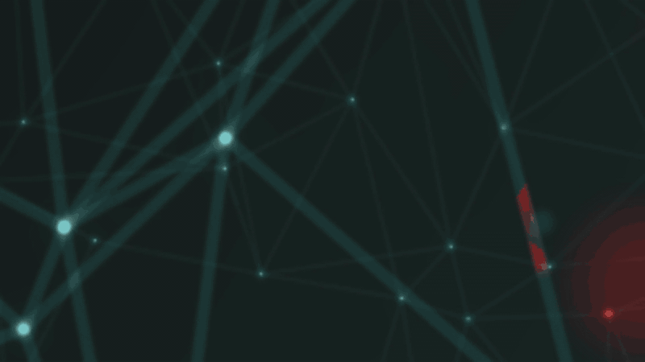

# Hypr-3LA

Three Hyprland plugins that give a tiling desktop a CCTV / surveillance-rig
aesthetic: **[3LA-Corners](#3la-corners)** frames every window with
targeting-reticle corner brackets, **[3LA-Feed-Loss](#3la-feed-loss)**
kills windows with a "signal lost" static burst instead of letting them blink
out, and **[3LA-GlitchClose](#3la-glitchclose)** does the same job with a GLSL
fragment shader rather than stacked quads.

Feed-Loss and GlitchClose are alternatives to each other, not companions --
both hook `window.close`, so running them together stacks two overlays on the
same window. Pick one.

All three are C++ Hyprland plugins built against **Hyprland 0.56.2**, configured
either through classic `hyprland.conf` keywords or Hyprland's Lua config
(`hl.config`), and installable with `hyprpm`.

```
3LA-Corners/              corner brackets decoration
3LA-Feed-Loss/            CPU-composited signal-loss burst
3LA-GlitchClose/          GLSL shader collapse  (alternative to Feed-Loss)
3LA-GlitchClose-Viewer/   WebGL tuner for the shader above
hyprpm.toml               plugin manifest + Hyprland/plugin commit pins
```

Each plugin directory is self-contained: `make` there produces the `.so`, and
`autoload.sh` is a startup fallback that loads it via `hyprctl` and re-applies
its settings.

## Demo

**3LA-GlitchClose** — three kitty terminals framed by 3LA-Corners, closed one by
one through `glitchclose:close`. Setup runs at 2×; the closes are real time:


([full-quality mp4](assets/glitchclose-demo.mp4))

Every frame of the collapse is one fragment-shader pass: v-sync seam, slice
tearing, macroblock corruption, whole-frame ghost copies, chromatic aberration
and static, with the caption composited on top so it stays legible. The window's
own border stays clean throughout — the effect is inset strictly inside it.

<details>
<summary><b>3LA-Feed-Loss</b> — the earlier CPU-composited version</summary>

Same sequence through `feedloss:close`, built from stacked rectangle and texture
draws rather than a shader:



([full-quality mp4](assets/feedloss-demo.mp4))

</details>

## Install

Via hyprpm (uses `hyprpm.toml` in this repo):

```sh
hyprpm add https://github.com/ne0tt/Hypr-3LA
hyprpm enable 3LA-Corners
hyprpm enable 3LA-GlitchClose   # or 3LA-Feed-Loss, not both
```

Or build and load manually:

```sh
make -C 3LA-Corners && make -C 3LA-GlitchClose   # or `make debug` for -g symbols
hyprctl plugin load "$PWD/3LA-Corners/3LA-Corners.so"
hyprctl plugin load "$PWD/3LA-GlitchClose/3LA-GlitchClose.so"
```

Autoload from `hyprland.lua`:

```lua
hl.plugin.load(os.getenv("HOME") .. "/git/Hypr-3LA/3LA-Corners/3LA-Corners.so")
hl.plugin.load(os.getenv("HOME") .. "/git/Hypr-3LA/3LA-GlitchClose/3LA-GlitchClose.so")
```

Then apply settings and reload without restarting Hyprland:

```sh
hyprctl eval 'dofile(os.getenv("HOME") .. "/.config/hypr/config/plugins.lua")'
```

### Requirements

- the `hyprland` package's headers (`/usr/include/hyprland`) and `pkg-config`
- a C++26 compiler (`g++`); the plugins link nothing — every symbol, including
  the GL entry points, resolves against the running compositor at `dlopen`
- a GL renderer for 3LA-GlitchClose; it disables itself on a Vulkan backend

**Plugins must be rebuilt whenever Hyprland updates.** The API commit hash is
checked at load time and a mismatch refuses to load with a notification rather
than crashing. Release builds are stripped — `make debug` keeps `-g` symbols for
backtraces, and the dynamic exports Hyprland needs survive stripping either way.

If you are installing via `hyprpm`, the `commit_pins` entry in `hyprpm.toml`
pairs a Hyprland commit with a plugin-repo commit; bump the second hash after
committing, or `hyprpm update` will keep fetching the older revision.

### Tuning GlitchClose

The shader has a lot of dials. Rather than closing a window every time you want
to see what one does, use the bundled WebGL tuner — it runs the plugin's actual
shader over a still image, with sliders and a scrubbable timeline:

```sh
make -C 3LA-GlitchClose-Viewer install-desktop   # optional: add to the app launcher
./3LA-GlitchClose-Viewer/run.sh
```

It has a **copy Lua** button that emits a ready-to-paste `pcall(hl.config, …)`
block. See [3LA-GlitchClose-Viewer/README.md](3LA-GlitchClose-Viewer/README.md).

## Configuration

Everything in this README uses Hyprland's Lua config: settings are applied
with `hl.config`, wrapped in `pcall` at startup so applying config for a
not-yet-loaded plugin can't break the rest of the config:

```lua
pcall(hl.config, { plugin = {
    ["3la_corners"]   = { offset = 10, length = 40, thickness = 1 },
    ["3la_feed_loss"] = { duration = 900, glitch = 3, text = "SIGNAL LOST" },
} })
```

(The classic `hyprland.conf` ini keywords work too, with the same option
names: `plugin { 3la_feed_loss { duration = 900 } }`.)

Live-tweak any option without reloading (`hyprctl keyword` does not work with
the Lua parser — use `hl.config`):

```sh
hyprctl eval 'hl.config({ plugin = { ["3la_feed_loss"] = { glitch = 5 } } })'
hyprctl getoption plugin:3la_feed_loss:duration   # inspect
```

The demo above uses matugen-generated colors — teal static and caption on a
theme backdrop — passed straight from the generated Lua color globals into the
`col.*` options.

## Reference setup (Lua config)

The exact wiring from a working config (`~/.config/hypr`):

**`hyprland.lua`** — register the plugins at startup, with an `autoload.sh`
fallback that loads via `hyprctl` and re-applies settings if the startup
registration doesn't take:

```lua
hl.plugin.load(os.getenv("HOME") .. "/git/Hypr-3LA/3LA-Corners/3LA-Corners.so")
-- 3LA-Feed-Loss is superseded by 3LA-GlitchClose. Do not load both: they both
-- listen to window.close and would stack two overlays on an unmanaged close.
hl.plugin.load(os.getenv("HOME") .. "/git/Hypr-3LA/3LA-GlitchClose/3LA-GlitchClose.so")

hl.on("hyprland.start", function()
    hl.exec_cmd(os.getenv("HOME") .. "/git/Hypr-3LA/3LA-Corners/autoload.sh")
    hl.exec_cmd(os.getenv("HOME") .. "/git/Hypr-3LA/3LA-GlitchClose/autoload.sh")
end)

require("config.colors")  -- matugen globals, before anything that uses them
require("config.plugins") -- plugin settings (see below)
```

**`config/plugins.lua`** — the settings, wrapped in `pcall` so applying config
for a not-yet-loaded plugin can't break the rest of the startup:

```lua
pcall(hl.config, {
    plugin = {
        ["3la_corners"] = {
            offset = 10, length = 40, thickness = 1,
            ["col.active"] = primary,   -- matugen color globals
            ["col.inactive"] = primary, -- same color: no focus-based change
            flash_count = 3, flash_duration = 200,
            flash_on_focus = 1, focus_flash_count = 2, focus_flash_duration = 75,
            glow = 1, ["glow.size"] = 10, ["glow.strength"] = 0.4,
            ["col.glow"] = 0,           -- follow the bracket color
        }
    }
})

pcall(hl.config, {
    plugin = {
        ["3la_glitch_close"] = {
            duration = 350, fade = 20, close_at = 1.0,
            strength = 0.38, aberration = 0.56, blocks = 0.15, noise = 0.00,
            scanlines = 0.37, roll = 0.08, melt = 0.10, vignette = 0.00,
            tear = 0.55, tear_speed = 2.0, ghost = 0.6,
            backdrop_alpha = 0.3,
            ["col.backdrop"] = on_secondary,   -- matugen color globals
            ["col.fringe1"] = on_error,
            ["col.fringe2"] = primary,

            text = "SIGNAL LOST", text_size = 16, text_at = 0.25,
            text_padding = 14, text_bg_round = 4, text_bg_alpha = 0.85,
            ["col.text"] = 0,      -- 0 = white
            ["col.text_bg"] = 0,   -- 0 = red
        }
    }
})
```

Re-running matugen re-themes a live effect: every colour is read as a shader
uniform each frame, so no plugin reload is needed.

Note that `hl.config` reports `unknown config key` **per key** for a plugin that
is not loaded, and does so *without raising* — the surrounding `pcall` does not
swallow it. Comment a plugin's settings block out at the same time as its
`hl.plugin.load` line, or every reload prints one error per option.

**`config/keyboard/keybindings.lua`** — the kill key, falling through to a plain
close when neither plugin is loaded (`hl.plugin.<name>` only exists while that
plugin is):

```lua
hl.bind(mainMod .. " + Q", function()
    if pcall(function() hl.plugin.glitchclose.close() end) then return end
    if pcall(function() hl.plugin.feedloss.close() end) then return end
    hl.dispatch(hl.dsp.window.close())
end, { description = "Close active window (glitch collapse)" })
```

Bind the tuner too, if you are iterating on the shader:

```lua
hl.bind(mainMod .. " + SHIFT + G",
    hl.dsp.exec_cmd(os.getenv("HOME") .. "/git/Hypr-3LA/3LA-GlitchClose-Viewer/run.sh"),
    { description = "GlitchClose shader tuner" })
```

---

# 3LA-Corners

Draws decorative corner brackets outside every window's border. Each corner
gets two line segments (horizontal + vertical) offset outside the window
border, like a targeting reticle. The focused window and unfocused windows can
be given different colors, and either window spawn or focus gain can trigger a
flash.

## Config

Defaults shown:

```lua
hl.config({ plugin = { ["3la_corners"] = {
    offset = 10,          -- gap (px) between the window border and the brackets
    length = 100,         -- arm length (px) of each bracket, from the corner
    thickness = 2,        -- line thickness (px)

    ["col.active"] = 0,   -- focused-window bracket color.
                          -- 0 = follow general:col.active_border (first color);
                          -- otherwise e.g. "rgba(33ccffee)"
    ["col.inactive"] = 0, -- unfocused-window bracket color.
                          -- 0 = follow col.active if that is set, else
                          -- general:col.inactive_border (first color)

    flash_count = 3,      -- times the brackets flash when a window SPAWNS (0 = off)
    flash_duration = 150, -- spawn flash on/off phase duration (ms)

    flash_on_focus = 0,         -- flash when a window gains FOCUS (0 = off, 1 = on)
    focus_flash_count = 3,      -- times the brackets flash per focus change (0 = off)
    focus_flash_duration = 150, -- focus flash on/off phase duration (ms)

    glow = 0,             -- soft halo behind the brackets DURING a flash burst
                          -- (0 = off). See "Glow" below: it is not drawn on
                          -- every frame, only while a burst is running.
    ["glow.size"] = 12,   -- halo spread distance (px)
    ["glow.strength"] = 0.5, -- overall halo intensity (0..1)
    ["col.glow"] = 0,     -- 0 = follow the bracket's own color
} } })
```

### Flashing

A burst is `count` on-pulses, each phase lasting `duration` ms, after which the
brackets settle to steady on. The two burst types are configured independently:

| Trigger | Count | Duration | Gate | Priority |
|---|---|---|---|---|
| window spawns | `flash_count` | `flash_duration` | always on | preempts any running burst |
| window gains focus | `focus_flash_count` | `focus_flash_duration` | `flash_on_focus = 1` | dropped while a spawn burst runs |

The focus flash needs **both** `flash_on_focus = 1` and a non-zero
`focus_flash_count`; setting either to `0` disables it. `flash_count = 0`
disables the spawn flash only — the two are configured independently.

**The spawn burst has priority.** A focus flash cannot preempt a spawn burst
that is still running; it is dropped, and the spawn burst plays to completion.
This matters because a new window takes focus in the same tick it opens, so
without the priority rule the focus burst would replace every spawn burst and
`flash_count` / `flash_duration` would have no visible effect. A spawn burst
preempts anything, including a running focus burst.

Burst parameters are captured when the burst is armed, so changing the options
mid-burst does not retime the burst already in flight. Re-triggering a focus
flash mid-burst restarts the sequence rather than queueing, so rapid alt-tabbing
stays in step with the focus rather than lagging behind it.

Burst expiry is time-based, computed from the instant the burst was armed rather
than from frames drawn. A burst therefore expires on schedule even while nothing
is being rendered — a window that spawns fullscreen (brackets hidden) does not
get stuck mid-burst or suppress its next flash.

### Glow

A soft halo behind the brackets, off by default (`glow = 0`).

**It only renders while a spawn or focus flash burst is actively running** — not
on every frame. The brackets sit plain the rest of the time, so the glow reads as
part of the flash rather than as a permanent style. That also means `glow = 1`
does nothing visible if both flash types are disabled.

It is **not a real blur.** A plugin cannot reach Hyprland's shadow shader, so
this is four expanded copies of each bracket box drawn behind it with fading
alpha — a stepped halo rather than a smooth one. `glow.size` sets how far the
outermost layer expands, `glow.strength` scales the whole stack. At large sizes
the banding between layers becomes visible; it reads best as a tight halo
(≤ ~16px) rather than a wide bloom.

`col.glow = 0` follows the bracket's own colour, including its flash alpha, so
the halo fades in and out with the pulse. Set it explicitly to tint the halo
differently from the brackets.

The decoration's damage region grows by `glow.size` whenever `glow` is on,
because the halo extends past the bracket boxes; without that its outer edge
leaves trails while a window is moved or resized.

### Active / inactive styling

The brackets render at **full alpha regardless of focus**, fully decoupled from
window opacity. The `a` alpha the renderer passes to the decoration is ignored
outright, so none of these affect the brackets:

- `decoration:active_opacity` / `decoration:inactive_opacity`
- per-window `opacity` window rules
- window fade-in/out and workspace-move alpha

Only two things set the final alpha: the alpha channel of the configured color
(`col.active` / `col.inactive`) and the flash envelope. Trade-off: brackets pop
in at full opacity when a window opens rather than fading with it.

> **If unfocused brackets look "dimmed", check `col.inactive` before suspecting
> opacity.** With `col.inactive = 0` the brackets follow
> `general:col.inactive_border`, which in most themes is a much darker shade than
> `col.active_border` — that reads as dimming but is pure color. Set both colors
> explicitly to the same value for identical brackets in both states.

Color resolution order:

| State | Order |
|---|---|
| focused | `col.active` -> `general:col.active_border` -> white |
| unfocused | `col.inactive` -> `col.active` -> `general:col.inactive_border` -> white |

The unfocused fallback to `col.active` means setting only `col.active` gives every
window the same bracket color. Distinct colors per state:

```lua
hl.config({ plugin = { ["3la_corners"] = {
  ["col.active"] = "rgba(33ccffee)", ["col.inactive"] = "rgba(6a7a85ff)",
} } })
```

## Notes

- The bracket ring is *reserved* space: tiled windows shrink by
  `offset + thickness` per side so brackets never overlap neighbors.
- Brackets are hidden on fullscreen windows. A burst armed on such a window still
  expires on its own schedule, since expiry is time-based rather than frame-driven.
- **Breaking:** the old `color` option was renamed to `col.active`. `color` is no
  longer registered and Hyprland will report it as an unknown option — rename it
  in your config.
- Active state is read per-frame from `Desktop::focusState()->isWindowActive()`,
  and the plugin listens on the `window.active` event to damage both the window
  losing focus and the one gaining it, so brackets repaint immediately on focus
  change. `flash_on_focus` reuses that same listener, subject to the spawn-burst
  priority rule above.
- While a flash is running the decoration damages itself every frame to drive the
  animation, so `flash_on_focus = 1` costs a short burst of redraws per focus
  change. On a heavily loaded GPU prefer a low `focus_flash_count`.
- **Removed:** `active_opacity` / `inactive_opacity` no longer exist. They fought
  with the compositor's own opacity handling; brackets are now always full alpha.
  Remove them from your config or Hyprland will report unknown options.

---

# 3LA-Feed-Loss

Plays a CCTV "signal lost" burst over a window when it closes: the window's own
content tears apart, scanlined static and a backdrop ramp in over it, a
`SIGNAL LOST` caption appears, and only then does the window actually close —
the overlay dissolving in a short fade while the layout re-tiles underneath.

## Timeline

One burst is `duration` ms plus a `fade` ms tail (defaults 900 + 300):

1. **Glitch** (whole burst): the window's *own content* breaks up — a
   framebuffer snapshot is torn into horizontally displaced slices, with
   whole-frame jitter, drifting ghost copies and magenta/cyan color fringe on
   some slices. Escalates over time and never ramps out: the burst ends
   mid-glitch.
2. **Collapse** (~40–60%): animated scanlined static ramps in over the still
   glitching picture, then a backdrop; stray noise bands tear across.
3. **Caption** (from ~58% to burst end): the blinking `SIGNAL LOST` caption,
   centered. Burst only — it never lingers into the fade over re-tiled
   neighbors.
4. **Close + fade**: the overlay fades out over `fade` ms starting at burst
   end, and the real close goes out at `close_at` × (`duration` + `fade`)
   (default: the very end of the fade tail, so the layout re-tiles only
   once the overlay is fully gone).

The overlay stays **inside the window's border**, so the border ring (and the
Corners brackets outside it) keeps framing the static until the window
actually closes.

Post-hoc closes (window died on its own — no snapshot possible) skip the
content tearing and cut straight to static, backdrop at ~8% and caption at
~16% of the burst.

## The `feedloss:close` dispatcher (use this to close windows)

If the burst only starts *after* a window is gone, the layout has already
re-tiled and the static plays over the neighbors that took the space. The
dispatcher fixes the ordering: it plays the burst over the **still-open**
window — its tile slot stays occupied, nothing moves — and sends the real
close request at `close_at` × (`duration` + `fade`) (default 100%: only
once the burst *and* the fade tail are both over). The re-tile then happens
after the overlay has fully dissolved, never underneath it.

Bind your kill key to it instead of `killactive` — the plugin registers a Lua
function, `hl.plugin.feedloss.close()` (see
[Reference setup](#reference-setup-lua-config) for a bind with a fallback):

```lua
hl.bind("SUPER + Q", function() hl.plugin.feedloss.close() end,
    { description = "Close active window (feed loss)" })
```

(Classic configs can use the dispatcher directly:
`bind = $mainMod, Q, feedloss:close`.)

Like `killactive` it *requests* the close, so apps can still show "unsaved
changes" dialogs — the feed comes back if the app refuses to die. Windows that
close on their own (app exits, `killactive` from elsewhere) still get a
post-hoc burst. A `feedloss:close` on a window the effect would skip (too
small, override-redirect, filtered) just closes it normally — the bind never
silently no-ops.

## Config

Defaults shown:

```lua
hl.config({ plugin = { ["3la_feed_loss"] = {
    duration = 900,        -- burst duration (ms); overlay at full strength throughout
    fade = 300,            -- overlay fade-out tail (ms) appended after the burst
    close_at = 1.0,        -- feedloss:close sends the real close at this
                           -- fraction of (duration + fade) (0 = close
                           -- immediately; 1 = only after the fade tail, so
                           -- the tile slot is held until the overlay is
                           -- fully gone)

    static_alpha = 0.55,   -- opacity of the animated static layer (0..1)
    backdrop_alpha = 0.75, -- opacity of the backdrop behind the static (0..1)
    glitch = 1,            -- glitch strength: 0 = off, 1 = normal, up to
                           -- 5 = extreme (scales tear amplitude and the
                           -- number of slices/bands)

    text = "SIGNAL LOST",  -- caption; "" = no caption
    text_size = 16,        -- caption font size (pt)
    text_alpha = 1.0,      -- caption opacity (0..1; 0 = hidden)
    text_blink = 1,        -- blink the caption (0 = steady)
    font = "monospace",    -- caption font family

    ["col.text"] = 0,      -- caption color (0 = white)
    ["col.static"] = 0,    -- static noise tint (0 = neutral gray); baked into
                           -- the noise textures, regenerated on config reload
    ["col.backdrop"] = 0,  -- backdrop color (0 = black); alpha comes from
                           -- backdrop_alpha, not the color
    ["col.fringe1"] = 0,   -- glitch-slice fringe color A (0 = magenta)
    ["col.fringe2"] = 0,   -- glitch-slice fringe color B (0 = cyan)

    min_size = 80,         -- skip windows smaller than this on either axis (px);
                           -- keeps menus/tooltips/popups from triggering bursts
    ignore_children = 1,   -- skip child windows — file open/save dialogs,
                           -- transients, modals (0 = burst on them too)

    -- Regex (C++ std::regex, NOT a Lua pattern) of window classes to never
    -- burst on; "" = filter off. The default catches portal file choosers
    -- (VS Code / Electron / Flatpak apps), which are separate processes and
    -- never look like children on Wayland.
    ignore_class = "^(xdg-desktop-portal.*)$",

    -- Same idea, matched against the window TITLE, for dialogs class alone
    -- can't identify, e.g. "^(Open File|Save As|Select Folder)$".
    -- "" (default) = filter off.
    ignore_title = "",
} } })
```

## Notes

- The effect is **screen-space**: it plays over the rectangle the window
  occupied when the burst started. Via `feedloss:close` that rectangle stays
  occupied by the window itself until `close_at` fires; for post-hoc bursts
  anything that moves into it (a neighbor re-tiling into the gap, a
  workspace slide) gets drawn over for the remaining duration.
- It composes with Hyprland's own close animation: the fade-out snapshot plays
  underneath the static. Setting the `fadeOut` animation faster (or off) makes
  the "feed cut" read harder; leaving it on reads more like corruption.
- The overlay renders at `RENDER_POST_WINDOWS`, i.e. above all windows but below
  top/overlay layers — bars and notifications stay on top of the static.
- If the workspace the window was on stops being the monitor's active (or
  active special) workspace mid-burst, drawing is suppressed; the burst still
  expires on its own schedule.
- X11 override-redirect surfaces and windows smaller than `min_size` don't
  trigger the effect, so context menus and tooltips stay quiet. With
  `ignore_children` on (default), child windows — xdg toplevels with a parent
  (including xdg-foreign), X11 transients/modals, xdg-dialog-v1 modals — are
  skipped too.
- Portal file choosers (`xdg-desktop-portal-gtk` etc.) are toplevels of a
  *separate process*; Electron apps like VS Code don't pass them a parent
  handle on Wayland, so they don't count as children. The `ignore_class`
  regex catches them by class instead (`ignore_title` exists for dialogs
  class can't identify).
- The class/title filters match against the window's *cached* class/title:
  the close event fires during unmap, when the xdg toplevel resource (what
  `fetchClass()` reads) can already be destroyed and would report `""`.
- Every burst start is logged at DEBUG level
  (`[3LA-Feed-Loss] burst on class='..' title='..'`) — check
  `hyprctl rollinglog` when a window bursts that you expected filtered.
- The glitch phase draws slices of a `makeSnapshotFB` capture taken when the
  effect starts, so it shows the window as it looked at the moment of "death" —
  everything is clipped to the window box, and slice geometry holds for 60 ms
  per step so it reads as tearing rather than shimmer. The snapshot framebuffer
  (potentially monitor-sized) lives only for the effect's duration.
- The static is 8 pre-baked 128×128 scanlined noise frames cycled every 45 ms
  and stretched over the window box — deliberately blocky, VHS-style. Textures
  are built lazily on first use and freed on unload.
- The caption texture is rendered once (at 2× size for hidpi sharpness) and
  cached; a config reload rebuilds it, so text/font/color changes apply live.
- While a burst runs its box is damaged every frame — cost is a sub-second
  full-redraw of that rectangle per closed window, nothing when idle.

# 3LA-GlitchClose

Same close mechanism as [3LA-Feed-Loss](#3la-feed-loss) — the effect plays over
the **still-open** window, the real close goes out at the end — but the whole
visual is a single GLSL fragment shader instead of a stack of rectangle and
texture draws.

Feed-Loss fakes its glitch on the CPU: per frame it submits jittered copies of
the window snapshot, a dozen torn slice quads, fringe rectangles and one of
eight pre-baked 128×128 noise textures. GlitchClose renders the window snapshot
through one shader pass into its own framebuffer and composites that. The
practical differences:

- displacement is **continuous and per-pixel**, not quantised to slice quads
- a real v-sync frame tear, which stacked quads cannot express: the seam needs
  the content on each side evaluated at a different animation step
- chromatic aberration is a real per-channel UV offset, not a tinted overlay
  rectangle
- static is sub-pixel and never repeats, instead of cycling 8 fixed frames
- one draw call per frame instead of ~40
- every knob is a live uniform, so re-running matugen re-themes the effect
  without reloading the plugin

## How it renders

Plugins cannot reach Hyprland's projection matrix (`monitorProjection` is
private to `CHyprOpenGLImpl`), so the shader never draws directly to the screen.
Instead, at `RENDER_POST_WINDOWS`:

1. the shader runs over a full-viewport quad into the effect's own framebuffer,
   using identity NDC coordinates — no matrix maths needed
2. that framebuffer is handed to an ordinary `CTexPassElement`, so Hyprland
   keeps owning positioning, clipping, damage and colour management

Because `makeSnapshotFB()` may return a monitor-sized framebuffer rather than a
window-sized one, the `uvOffset` / `uvXf` uniforms map the window's sub-rect onto
0..1 — the glitch geometry stays window-local either way. `uvXf` is a full `mat2`
rather than a scale because that snapshot is rendered through the monitor's own
projection: on a rotated (portrait) monitor the window's pixels sit rotated
inside it, and carrying that rotation in the mapping is what keeps the tearing
running across the window instead of down it. For the same reason the composite
does *not* set `flipEndFrame` — that flag composes the monitor transform's
inverse into the texture transform, which is right for a snapshot FB but would
rotate the finished effect a second time.

Program binding goes through `g_pHyprOpenGL->useShader()` rather than raw
`glUseProgram()`: `CHyprOpenGLImpl` caches the bound program to skip redundant
binds, and desyncing that cache breaks the *next* Hyprland draw. Viewport and
blend go through the renderer wrappers for the same reason.

## The `glitchclose:close` dispatcher (use this to close windows)

As with Feed-Loss, closing first and animating afterwards means the layout has
already re-tiled and the effect plays over the neighbours that took the space.
The dispatcher fixes the ordering: the collapse plays over the still-open
window, and the real close request goes out at `close_at` × (`duration` +
`fade`) — by default on the frame the overlay expires.

**The overlay never outlives the window.** The effect owns a fixed `duration` +
`fade` span and is erased when that span ends, whatever the window does; with
the default `close_at = 1.0` the close request is only sent at the end of it, so
the unmap — and the re-tile that follows — cannot happen until the last glitched
pixel is gone. Nothing is ever drawn over the neighbours that take the space,
and an application that refuses to close (an unsaved-changes dialog) cannot pin
the glitch on screen either.

The trade-off is at the other end: the `fade` tail now dissolves back towards
the **still-live** window, so a long `fade` means watching the untouched window
come back into view before it closes. Keep `fade` short — tens of ms reads as a
hard cut — or set `close_at` below 1 to send the close mid-burst, accepting some
glitch over the re-tiled layout in exchange.

```lua
hl.bind("SUPER + Q", function() hl.plugin.glitchclose.close() end,
    { description = "Close active window (glitch collapse)" })
```

(Classic configs: `bind = $mainMod, Q, glitchclose:close`.)

Note that `hyprctl dispatch glitchclose:close` does **not** work under the Lua
config parser — it parses the argument as Lua. Use
`hyprctl eval 'hl.plugin.glitchclose.close()'` instead.

Windows closed by something else (an external `killactive`, an app responding to
a close request) still get a post-hoc effect, driven by the `window.close`
event. That event fires at *unmap*, so the snapshot capture usually fails on
this path and the shader falls back to its static-only mode (`hasTex = 0`).
An application that simply **exits on its own** never emits `window.close`
at all, so it gets no effect — this is inherent to the event, and Feed-Loss
behaves identically.

## Config

Defaults shown:

```lua
pcall(hl.config, {
    plugin = {
        ["3la_glitch_close"] = {
            duration = 700,        -- collapse duration (ms)
            fade = 80,             -- fade-out tail (ms) AFTER the collapse. it
                                   -- dissolves back towards the still-live
                                   -- window, so keep it short
            close_at = 1.0,        -- when glitchclose:close sends the real close,
                                   -- as a fraction of `duration` + `fade`
                                   -- (1 = as the overlay expires, before the
                                   -- window unmaps)

            strength = 1.0,        -- master multiplier on every displacement
                                   -- term (0 = calm, up to 5 = extreme)
            aberration = 0.5,      -- RGB channel split
            blocks = 0.6,          -- slice tearing + macroblock corruption
            noise = 0.5,           -- digital static
            scanlines = 0.4,       -- CRT scanline darkening
            roll = 0.5,            -- rolling bright bar sweeping the window
            melt = 0.5,            -- wavy vertical tear boundary; 0 = the torn
                                   -- edge shears flat instead of rippling
            tear = 0.5,            -- v-sync frame tear (0 = off)
            tear_speed = 3.0,      -- seam sweeps per burst
            ghost = 0.5,           -- whole-frame echo copies (0 = off)
            vignette = 0.4,        -- edge darkening as the feed collapses
            backdrop_alpha = 0.75, -- opacity the backdrop collapses to

            ["col.backdrop"] = 0,  -- 0 = black
            ["col.fringe1"] = 0,   -- 0 = magenta
            ["col.fringe2"] = 0,   -- 0 = cyan

            -- Caption drawn OVER the shader output (not fed through the
            -- glitch, so it stays legible). Burst only, never the fade tail.
            text = "SIGNAL LOST",  -- "" turns the caption off entirely
            font = "monospace",
            text_size = 16,        -- pt
            text_alpha = 1.0,      -- 0 = plate with no text
            text_at = 0.4,         -- fraction of duration before it appears
            text_blink = 0,        -- blink half-period in ms (0 = steady)
            text_padding = 14,     -- gap between text and plate edge (px)
            text_bg_round = 4,     -- plate corner radius (px)
            text_bg_alpha = 0.85,  -- 0 = text with no plate
            ["col.text"] = 0,      -- 0 = white
            ["col.text_bg"] = 0,   -- 0 = red

            min_size = 80,         -- skip windows smaller than this (px)
            ignore_children = 1,   -- skip dialogs, transients, modals
            ignore_class = "^(xdg-desktop-portal.*)$",
            ignore_title = "",
        }
    }
})
```

`strength` scales *all* displacement; the individual weights are 0..1 dials on
one shader stage each, so `strength = 2, blocks = 0` gives heavy melt and
aberration with no slice displacement.

`ghost` is the third. It echoes the **whole frame** sideways at low alpha,
added rather than blended so overlaps brighten — text and logos come out doubled.
This is the most recognisable part of the old 3LA-Feed-Loss look, which produced
it by stacking two extra snapshot draws at ± offset; it is what makes a torn
frame read as a *doubled signal* rather than merely displaced strips. Turn it
down to `0` for clean shearing with no echo.

`blocks` and `tear` are different things despite both being "tearing". `blocks`
scatters many short-lived horizontal strips at random offsets. `tear` is a single
coherent **v-sync seam** that sweeps down the window, with everything below it
shifted sideways as though that half of the frame arrived late — and evaluated
one animation step out of date, so the two sides of the seam carry different
slice, macroblock and grain patterns. That staleness is what makes it read as a
frame boundary rather than a plain horizontal offset. `tear_speed` sets how many
times the seam crosses during the burst; with a short `duration`, 1–2 reads as a
deliberate glitch and anything higher as a strobe.

The caption is composited on top of the shader rather than passed through it, so
it stays readable while the window behind it tears apart. It is drawn during the
burst only: the fade tail dissolves back towards the still-live window, where a
dissolving glitch still reads as an effect but a legible caption on top of a
window coming back into view reads as a bug. Note `text_at` is a fraction of `duration` — with
a short `duration` a default of `0.4` leaves very little time on screen.

For matugen theming, pass the globals from your generated `colors.lua`:

```lua
["col.backdrop"] = background,
["col.fringe1"] = primary,
["col.fringe2"] = on_error,
```

These are read as uniforms every frame, so re-running matugen re-themes a live
effect with no plugin reload.

## Tuning it

[`3LA-GlitchClose-Viewer/`](3LA-GlitchClose-Viewer) is a WebGL2 tuner: scrub the
close animation over a still image, move the sliders, copy the result straight
into `plugins.lua` — rather than closing a terminal every time you want to see
what a value does.

```sh
make -C 3LA-GlitchClose-Viewer open
```

It has no shader of its own. `sync.py` extracts the GLSL from `shader.hpp` and
the option list — keys, defaults, min/max — from `main.cpp`, so the controls are
whatever the plugin currently registers, and a config key with no matching
uniform is a build error rather than a dead slider.

## Notes

- **The border is never glitched.** The effect box is inset by the window's
  border width, so no border pixel is fed through the shader and the border ring
  stays intact while the content tears apart. Without the inset the box sits
  flush against the border and edge sampling drags border colour inward, drawing
  a bright 1px frame around the effect. The cost is that the outermost 1px ring
  of window content is left untouched, which is not noticeable at typical border
  widths.
- The shader is compiled lazily on the first frame of the first effect (the GL
  context is only guaranteed current mid-render). A compile failure logs, raises
  one notification, and latches off — closes then behave like a plain
  `killactive` rather than retrying every frame.
- Requires the GL renderer; the effect disables itself on a Vulkan backend.
- `ignore_class` / `ignore_title` are C++ `std::regex`, **not** Lua patterns.
- Skip reasons are logged at `TRACE` (enable with `debug:enable_trace`) — useful
  when a close silently produces no effect.
